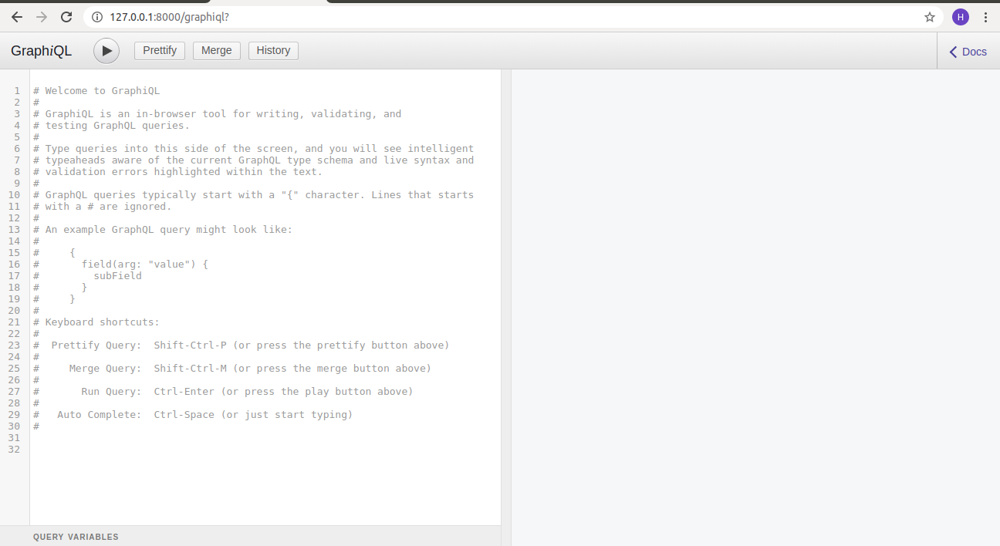
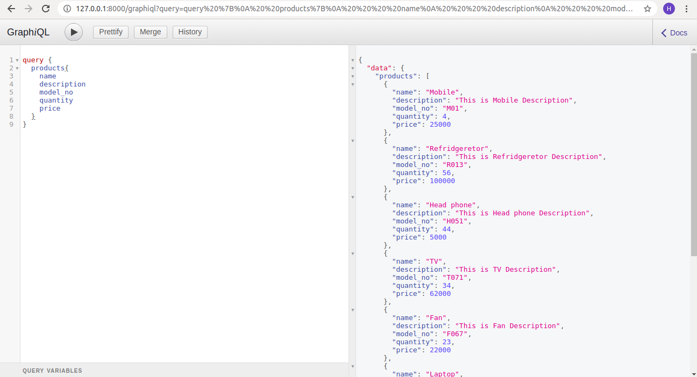
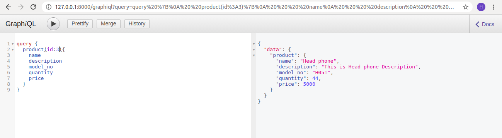
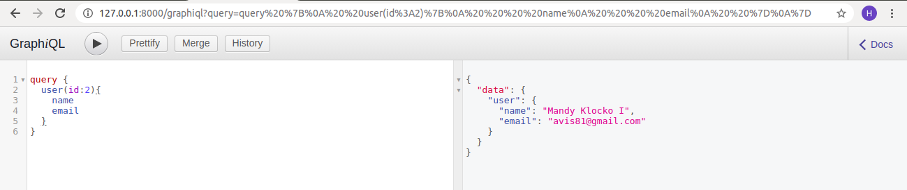
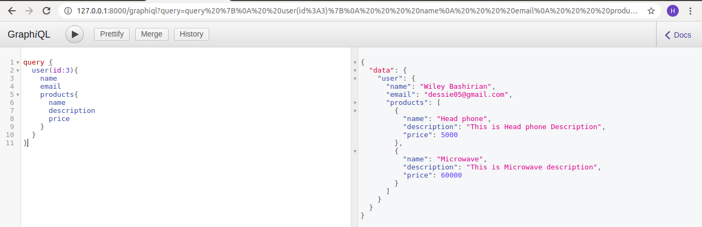
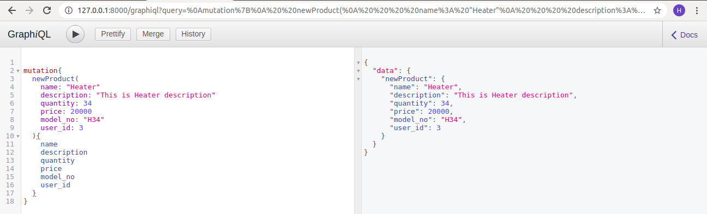
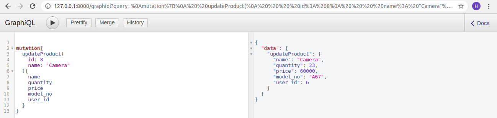
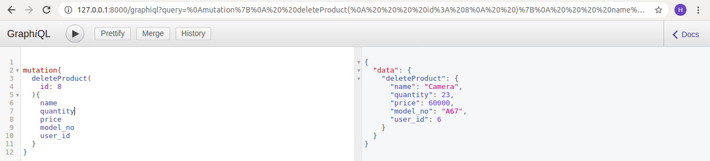

## **GraphQL with Laravel**

#### **What is GraphQL**

GraphQL is open source data query language for APIs and a runtime for fulfilling those queries with your existing data.
GraphQL was developed internally by Facebook in 2012. GraphQL provides a complete and understandable description of the data in your API,
gives clients the power to ask for exactly what they need and nothing more, makes it easier to evolve APIs over time, and enables powerful developer tools.

#### **Why should we use GraphQL**

Apps using GraphQL are fast and stable because they control the data they get, not the server. 

Send a GraphQL query to your API and get exactly what you need, nothing more and nothing less.

GraphQL queries always return predictable results.

GraphQL queries access not just the properties of one resource but also smoothly follow references between them.

While typical REST APIs require loading from multiple URLs, GraphQL APIs get all the data your app needs in a single request.

Apps using GraphQL can be quick even on slow mobile network connections.

Access the full capabilities of your data from a single endpoint.

GraphQL uses types to ensure Apps only ask for what’s possible and provide clear and helpful errors.

Apps can use types to avoid writing manual parsing code.

GraphQL APIs give apps continuous access to new features and encourage cleaner, more maintainable server code.

Write GraphQL APIs that leverage your existing data and code with GraphQL engines available in many languages.

You provide functions for each field in the type system, and GraphQL calls them with optimal concurrency.

#### **How to implement GraphQL**

We are going to implement GraphQL to our laravel App. let's follow the below steps.

**1) create one laravel project.**

    composer create-project --prefer-dist laravel/laravel laraGraphQL
    
**2) Create migration file and model for product**

        cd  laraGraphQL  
        php artisan make:model Product -m
        
This command will create migration file and model file for product. 

Now, open the file `2020_02_27_084330_create_product_table.php` and put the following code inside it:

    <?php
    
    use Illuminate\Database\Migrations\Migration;
    use Illuminate\Database\Schema\Blueprint;
    use Illuminate\Support\Facades\Schema;
    
    class CreateProductTable extends Migration
    {
        /**
         * Run the migrations.
         *
         * @return void
         */
        public function up()
        {
            Schema::create('products', function (Blueprint $table) {
                $table->bigIncrements('id');
                $table->string('name', 50);
                $table->text('description');
                $table->integer('quantity');
                $table->float('price',8,2);
                $table->string('model_no', 50);
                $table->unsignedBigInteger('user_id');
                $table->timestamps();
    
                $table->foreign('user_id')->references('id')->on('users');
            });
        }
    
        /**
         * Reverse the migrations.
         *
         * @return void
         */
        public function down()
        {
            Schema::dropIfExists('products');
        }
    }

To test API, we will feed some initial data to our database. For that We will make one seeder file.

    php artisan make:seeder ProductsTableSeeder
    
This command will generate seeder file `database/seed/ProductsTableSeeder.php`. open this file and change the content as below.

    <?php
    
    use Illuminate\Database\Seeder;
    use App\Product;
    
    class ProductTableSeeder extends Seeder
    {
        /**
         * Run the database seeds.
         *
         * @return void
         */
        public function run()
        {
            Product::create([
                'name' => 'Mobile',
                'description' => 'This is Mobile Description',
                'quantity' => '4',
                'price' => '25000',
                'model_no' => 'M01',
                'user_id'=>'1'
            ]);
    
            Product::create([
                'name' => 'Refridgeretor',
                'description' => 'This is Refridgeretor Description',
                'quantity' => '56',
                'price' => '100000',
                'model_no' => 'R013',
                'user_id'=>'1'
            ]);
    
            Product::create([
                'name' => 'Head phone',
                'description' => 'This is Head phone Description',
                'quantity' => '44',
                'price' => '5000',
                'model_no' => 'H051',
                'user_id'=>'1'
            ]);
    
            Product::create([
                'name' => 'TV',
                'description' => 'This is TV Description',
                'quantity' => '34',
                'price' => '62000',
                'model_no' => 'T071',
                'user_id'=>'1'
            ]);
    
            Product::create([
                'name' => 'Fan',
                'description' => 'This is Fan Description',
                'quantity' => '23',
                'price' => '22000',
                'model_no' => 'F067',
                'user_id'=>'1'
            ]);
    
            Product::create([
                'name' => 'Laptop',
                'description' => 'This is Laptop Description',
                'quantity' => '64',
                'price' => '50000',
                'model_no' => 'L089',
                'user_id'=>'1'
            ]);
        }
    }
    
We will add some test data to `UsersTableSeeder.php file` in the same folder. Add the below code to it.

    <?php
    
    use Illuminate\Database\Seeder;
    
    class UsersTableSeeder extends Seeder
    {
        /**
         * Run the database seeds.
         *
         * @return void
         */
        public function run()
        {
            \App\User::truncate();
    
            $faker = \Faker\Factory::create();
            $password = bcrypt('secret');
    
            \App\User::create([
                'name'     => $faker->name,
                'email'    => 'graphql@test.com',
                'password' => $password,
            ]);
    
            for ($i = 0; $i < 10; ++$i) {
                \App\User::create([
                    'name'     => $faker->name,
                    'email'    => $faker->email,
                    'password' => $password,
                ]);
            }
        }
    }

    
Now, edit the `DatabaseSeeder.php` file you find in the same folder and invoke the `ProductsTableSeeder` class and `UsersTableSeeder` class inside the run() method. 
The following is the resulting code:

    <?php
    
    use Illuminate\Database\Seeder;
    
    class DatabaseSeeder extends Seeder
    {
        /**
         * Seed the application's database.
         *
         * @return void
         */
        public function run()
        {
            Eloquent::unguard();
    
            //disable foreign key check for this connection before running seeders
            DB::statement('SET FOREIGN_KEY_CHECKS=0;');
            $this->call(UsersTableSeeder::class);
            $this->call(ProductTableSeeder::class);
    
            // supposed to only apply to a single connection and reset it's self
            // but I like to explicitly undo what I've done for clarity
            DB::statement('SET FOREIGN_KEY_CHECKS=1;');
        }
    }
    
We will add the fillable fields to `Product` model file and will define User-Product one to many relationship like below.

    <?php
    
    namespace App;
    
    use Illuminate\Database\Eloquent\Model;
    
    class Product extends Model
    {
        /**
         * The attributes that are mass assignable.
         *
         * @var array
         */
        protected $fillable = [
            'name', 'description','quantity','price','model_no','user_id'
        ];
    
        /**
         * @return \Illuminate\Database\Eloquent\Relations\BelongsTo
         */
        public function user()
        {
            return $this->belongsTo(User::class);
        }
    }
    
Also we will add User-Product relationship to `app\User.php` model file.

    <?php
    
    namespace App;
    
    use Illuminate\Contracts\Auth\MustVerifyEmail;
    use Illuminate\Foundation\Auth\User as Authenticatable;
    use Illuminate\Notifications\Notifiable;
    
    class User extends Authenticatable
    {
        use Notifiable;
    
        /**
         * The attributes that are mass assignable.
         *
         * @var array
         */
        protected $fillable = [
            'name', 'email', 'password',
        ];
    
        /**
         * The attributes that should be hidden for arrays.
         *
         * @var array
         */
        protected $hidden = [
            'password', 'remember_token',
        ];
    
        /**
         * The attributes that should be cast to native types.
         *
         * @var array
         */
        protected $casts = [
            'email_verified_at' => 'datetime',
        ];
    
        /**
         * @return \Illuminate\Database\Eloquent\Relations\HasMany
         */
        public function products()
        {
            return $this->hasMany(Product::class);
        }
    }

After this, you are ready to create the table schema and to populate it. Type the following in a console window:

    php artisan migrate:fresh --seed

**3) Install the GraphQL Library**

To support GraphQL in the application, we need to install a library that allows us to define schemas and queries in a simple way.

    composer require rebing/graphql-laravel
    
After the installation, we need to run the following command:

    php artisan vendor:publish --provider="Rebing\GraphQL\GraphQLServiceProvider"
    
This command extracts the `graphql.php` configuration file from the vendor folder and put it into the config folder.

**4) Create a Product type**

We will start by creating the API's schema by defining the resource returned. 
To do this, create the `GraphQL` directory inside the app directory. This directory will contain all the definitions we need for the GraphQL schema of the API.
In the `app/GraphQL` directory, create the Types directory and put in it a file called `ProductType.php` with the following content:

    <?php
    
    namespace App\GraphQL\Types;
    
    use App\Product;
    use GraphQL\Type\Definition\Type;
    use Rebing\GraphQL\Support\Type as GraphQLType;
    
    class ProductType extends GraphQLType
    {
        protected $attributes = [
            'name' => 'Product',
            'description' => 'Details about a product',
            'model' => Product::class
        ];
    
        public function fields(): array
        {
            return [
                'id' => [
                    'type' => Type::nonNull(Type::int()),
                    'description' => 'Id of the product',
                ],
                'name' => [
                    'type' => Type::nonNull(Type::string()),
                    'description' => 'The name of the product',
                ],
                'description' => [
                    'type' => Type::nonNull(Type::string()),
                    'description' => 'Short description of the product',
                ],
                'quantity' => [
                    'type' => Type::nonNull(Type::int()),
                    'description' => 'The quantity of the product',
                ],
                'price' => [
                    'type' => Type::nonNull(Type::float()),
                    'description' => 'The price the product',
                ],
                'model_no' => [
                    'type' => Type::nonNull(Type::string()),
                    'description' => 'The model no of the product',
                ],
                'user_id' => [
                    'type' => Type::nonNull(Type::int()),
                    'description' => 'The user_id of the product',
                ]
            ];
        }
    }

Also create `app/GraphQL/Types/UserType.php` file. And add below code to it.

    <?php
    
    namespace App\GraphQL\Types;
    
    use App\User;
    use GraphQL\Type\Definition\Type;
    use Rebing\GraphQL\Support\Type as GraphQLType;
    use Rebing\GraphQL\Support\Facades\GraphQL;
    
    class UserType extends GraphQLType
    {
        protected $attributes = [
            'name' => 'User',
            'description' => 'Details about a user',
            'model' => User::class
        ];
    
        public function fields(): array
        {
            return [
                'id' => [
                    'type' => Type::nonNull(Type::int()),
                    'description' => 'Id of the User',
                ],
                'name' => [
                    'type' => Type::nonNull(Type::string()),
                    'description' => 'The name of the User',
                ],
                'email' => [
                    'type' => Type::nonNull(Type::string()),
                    'description' => 'Short description of the User',
                ],
                'password' => [
                    'type' => Type::nonNull(Type::string()),
                    'description' => 'The quantity of the User',
                ],
                'products' => [
                    'type' => Type::listOf(GraphQL::type('Product')),
                    'description' => 'user products',
                ]
            ];
        }
    
    }
    
We have added products field in the fields function which will show the products of the user.
    
**5) Create the GraphQL Queries**

Create a Queries directory inside the `./app/GraphQL` directory and put there a file called `ProductsQuery.php` with the following content:

    <?php
    
    namespace App\GraphQL\Queries;
    
    use App\Product;
    use GraphQL\Type\Definition\Type;
    use Rebing\GraphQL\Support\Query;
    use Rebing\GraphQL\Support\Facades\GraphQL;
    
    class ProductsQuery extends Query
    {
        protected $attributes = [
            'name' => 'products',
        ];
    
        public function type(): Type
        {
            return Type::listOf(GraphQL::type('Product'));
        }
    
        public function resolve($root, $args)
        {
            return Product::all();
        }
    }
    
The ProductsQuery class defined in this file represents a query that returns the list of products from the Product Store. You see that the query's name is products. 
The type() method returns the type of the resource returned by the query, expressed as a list of Product type items. 
The resolve() method actually returns the list of products by using the all() method of the Product model.

In the same way, create a second file in the `./app/GraphQL/Queries` directory called `ProductQuery.php` (note that, this time, product is singular). 
In this file, add the following code:

    <?php
    
    namespace App\GraphQL\Queries;
    
    use App\Product;
    use GraphQL\Type\Definition\Type;
    use Rebing\GraphQL\Support\Query;
    use Rebing\GraphQL\Support\Facades\GraphQL;
    
    class ProductQuery extends Query
    {
        protected $attributes = [
            'name' => 'product',
        ];
    
        public function type(): Type
        {
            return GraphQL::type('Product');
        }
    
        public function args(): array
        {
            return [
                'id' => [
                    'name' => 'id',
                    'type' => Type::int(),
                    'rules' => ['required']
                ],
            ];
        }
    
        public function resolve($root, $args)
        {
                return Product::findOrFail( $args['id']);
        }
    }
    
In this case, the `ProductQuery.php` file contains the definition of the query returning a single product identified by the id field. 
Notice that the definition of the id argument specifies that the argument must be an integer and that it is mandatory(required). 
You should be able to read the meaning of the other members of the ProductQuery class: the query's name is product, the returned type is Product, 
and the returned resource is the product identified by the id field.

Same as this, we will make a UserQuery in same folder.

    <?php
    
    namespace App\GraphQL\Queries;
    
    use App\User;
    use GraphQL\Type\Definition\ResolveInfo;
    use GraphQL\Type\Definition\Type;
    use Rebing\GraphQL\Support\Query;
    use Rebing\GraphQL\Support\Facades\GraphQL;
    
    class UserQuery extends Query
    {
        protected $attributes = [
            'name' => 'user',
        ];
    
        public function type(): Type
        {
            return GraphQL::type('User');
        }
    
        public function args(): array
        {
            return [
                'id' => ['name' => 'id', 'type' => Type::int()],
                'email' => ['name' => 'email', 'type' => Type::string()],
                'first' => ['name' => 'first', 'type' => Type::int()],
            ];
        }
    
        public function resolve($root, $args, $context, ResolveInfo $info)
        {
            $user = new User;
    
            // check for limit
            if( isset($args['first']) ) {
                $user =  $user->limit($args['first'])->latest('id');
            }
    
            if(isset($args['id']))
            {
                $user = $user->where('id' , $args['id']);
            }
    
            if(isset($args['email']))
            {
                $user = $user->where('email', $args['email']);
            }
    
            return $user->first();
        }
    }

**6) Registering the Schema**

After creating these types and queries, you need to register these items as the GraphQL schema in your API. 
So, open the `config/graphql.php` file and replace the current definition of 'schemas' with the following:

    'schemas' => [
            'default' => [
                'query' => [
                     'product' => App\GraphQL\Queries\ProductQuery::class,
                     'products' => App\GraphQL\Queries\ProductsQuery::class,
                     'user' => App\GraphQL\Queries\UserQuery::class,
                ],                
            ],
        ],

Here you are saying that the schema of your GraphQL API consists of three queries named product, products and user, mapped to ProductQuery, ProductsQuery and UserQuery
classes respectively.

Then, in the same file, replace the current definition of 'types' with the following:

    'types' => [
            'Product' => App\GraphQL\Types\ProductType::class,
            'User' => App\GraphQL\Types\UserType::class,
    ],
    
This definition maps the type GraphQL Product to the ProductType class and User to the UserType class.

**7) Create a mutator**

Now let’s add a mutator for creating a new product. 
Create a `Mutations` directory inside the `./app/GraphQL` directory and put there a file called `NewProductMutation.php` with the following content:

    <?php
    
    namespace App\GraphQL\Mutations;
    
    use Rebing\GraphQL\Support\Facades\GraphQL;
    use GraphQL\Type\Definition\Type;
    use Rebing\GraphQL\Support\Mutation;
    use App\Product;
    
    class NewProductMutation extends Mutation
    {
        protected $attributes = [
            'name' => 'newProduct'
        ];
    
        public function type(): Type
        {
            return GraphQL::type('Product');
        }
    
        public function args(): array
        {
            return [
                'name' => [
                    'name' => 'name',
                    'type' => Type::nonNull(Type::string())
                ],
                'description' => [
                    'name' => 'description',
                    'type' =>  Type::nonNull(Type::string()),
                ],
                'quantity' => [
                    'name' => 'quantity',
                    'type' =>  Type::nonNull(Type::int()),
                ],
                'price' => [
                    'name' => 'price',
                    'type' => Type::nonNull(Type::float())
                ],
                'model_no' => [
                    'name' => 'model_no',
                    'type' =>  Type::nonNull(Type::string()),
                ],
                'user_id' => [
                    'name' => 'user_id',
                    'type' =>  Type::nonNull(Type::int()),
                ]
            ];
        }
    
        public function resolve($rootValue, array $args)
        {
            $product = new Product();
            $product->fill($args);
            $product->save();
    
            return $product;
        }
    }

Add a mutator for update a product. Create a `UpdateProductMutation.php` file inside `./app/GraphQL/Mutations` directory and put the following content:

    <?php
    
    namespace App\GraphQL\Mutations;
    
    use Rebing\GraphQL\Support\Facades\GraphQL;
    use GraphQL\Type\Definition\Type;
    use Rebing\GraphQL\Support\Mutation;
    use App\Product;
    
    class UpdateProductMutation extends Mutation
    {
        protected $attributes = [
            'name' => 'updateProduct'
        ];
    
        public function type(): Type
        {
            return GraphQL::type('Product');
        }
    
        public function args(): array
        {
            return [
    
                'id' => [
                    'name' => 'id',
                    'type' =>  Type::nonNull(Type::int()),
                ],
                'name' => [
                    'name' => 'name',
                    'type' => Type::nonNull(Type::string())
                ]
            ];
        }
    
        public function resolve($rootValue, array $args)
        {
            $product = Product::find($args['id']);
            if (!$product) {
                return null;
            }
            $product->name = $args['name'];
            $product->save();
            return $product;
        }
    
    }

Add a mutator for delete a product. Create a `DeleteProductMutation.php` file inside `./app/GraphQL/Mutations` directory and put the following content:

    <?php
    
    namespace App\GraphQL\Mutations;
    
    use Rebing\GraphQL\Support\Facades\GraphQL;
    use GraphQL\Type\Definition\Type;
    use Rebing\GraphQL\Support\Mutation;
    use App\Product;
    
    class DeleteProductMutation extends Mutation
    {
        protected $attributes = [
            'name' => 'deleteProduct'
        ];
    
        public function type(): Type
        {
            return GraphQL::type('Product');
        }
    
        public function args(): array
        {
            return [
    
                'id' => [
                    'name' => 'id',
                    'type' =>  Type::nonNull(Type::int()),
                ],
    
            ];
        }
    
        public function resolve($rootValue, array $args)
        {
            $product = Product::find($args['id']);
            if (!$product) {
                return null;
            }
            $product->delete();
            return $product;
        }
    
    }

Let's register mutations in `config/graphql.php` file.

    'schemas' => [
            'default' => [
                ....
                'mutation' => [
                    'newProduct' => App\GraphQL\Mutations\NewProductMutation::class,
                    'updateProduct' => App\GraphQL\Mutations\UpdateProductMutation::class,
                    'deleteProduct' => App\GraphQL\Mutations\DeleteProductMutation::class,
                ],
                ....
            ],
        ],

**7) Testing the API with GraphiQL**

For the testing in graphql, we need to download graphql and install it to our system. you can download it from here https://www.electronjs.org/apps/graphiql
and run below command to terminal.

    php artisan serve
    
Lets run it on browser.

    http://127.0.0.1:8000/graphiql
    
And then you can see the below screen.

 

Let's write a query for access products list.

Get particular Product

Get User

Get User's product

Add Product

Update Product

Delete Product

That's it. Happy Coding :)

